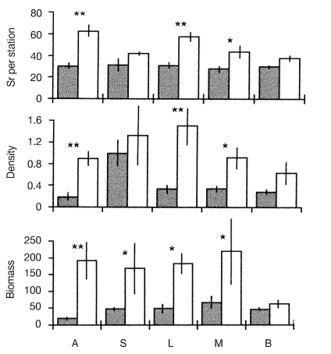
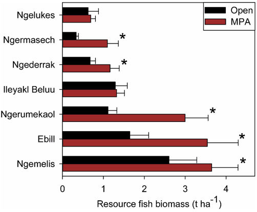
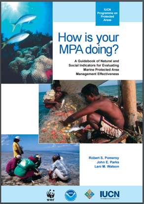
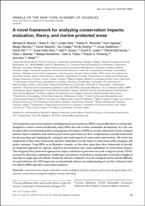

```{r setup, include=FALSE}
knitr::opts_chunk$set(echo = FALSE)
```

## Temas

# Indicadores comunes

## Indicadores comunes

- Biológicos

- Socioeconómicos

- Gobernanza

# Diseños de muestreo

Antes-Después   
Dentro-Fuera    
Antes-Después-Dentro-Fuera

## Experimentos aleatorios controlados

- Las RM no se asignan aleatoriamente
- Los candidatos tienen (o tenían) características clave:
    - Conectividad
    - Productividad
    - Heterogeneidad de hábitat

- Hay que ser cuidadosos al evaluar reservas, pues podemos malinformar
- Los siguientes ejemplos **no** son malos estudios, **nuestra** interpretación es mala

## Evaluación Antes-Después

**Características**

- Se evalúan cambios en los indicadores a través del tiempo
- No hay un sitio control

## Evaluación Antes-Después

**Ejemplo:** @wantiez_1997-VH

- RMs en Nueva Celadonia
- Comparación entre 1990 y 1994
- Comparan riqueza, biomasa y densidades

## Evaluación Antes-Después {.smaller}

**Resultados**

<center>

</center>

- *"Marine reserve protection* **resulted** *in an increase in the relative abundance and  species richness of  large edible species within the assemblages"*
- *"Species richness, density, and biomass of fish on the protected reefs increased respectively by 67%, 160% and 246%.* ** This increase was statistically  significant."**

## Evaluación Antes-Después

**Reflexiones**

- **Sí hay un cambio** pero...
    - es a través del tiempo (*i.e.* sí hay más después de 4 años)
    - no hay **evidencia** de que sea por efecto de la reserva
    - El análisis prueba la hipótesis $H_0: \mu_1-\mu_2 = 0$
    - Tendemos a asumir que hay una relación causal
- No toma en cuenta otras intervenciones
- El ambiente entero se pudo haber hecho más productivo [@szuwalski_2017-jc]
- Interpretación (errónea): Implementar una reserva incrementa la biomasa en 246%

## Evaluación Dentro-Fuera

**Características**

- Se evalúan diferencias entre dentro y fuera
- No hay componente temporal (suele ser por falta de línea base)

## Evaluación Dentro-Fuera

**Ejemplo:** @friedlander_2017-oI

- Red de AMPs de Palau (se enfocan en las RM)
- Implementadas en 2003 (pero larga historia de manejo comunitario)
- Estudio prube diferentes hipótesis, pero nos interesa la de la reserva
- Usan biomasa de peces pra medir el efecto
- Controles son: *"similar adjacent unprotected habitats"*

## Evaluación Dentro-Fuera

**Resultados**
<center>

</center>

- *"Our results showed that no-take MPAs had, on average, nearly twice the biomass of resource fishes (i.e. those important commercially, culturally, or for subsistence) compared to nearby unprotected areas."*
- También mencionan que estos cambios no eran evidentes en especies no pescadas.

## Evaluación Dentro-Fuera

Reflexiones

- Existen diferencias entre RM y Control
    - Se rechaza $H_0: \mu_1-\mu_2 = 0$
- Las especies no pescadas no responden al tratamiento
- Mejor aproximación que antes-después, pero aún no podemos inferir causalidad
- No es un experimento controlado (las reservas se pusieron ahí por una razón)

## Evaluación Antes-Después-Control-Impacto

Características

## Evaluación Antes-Después-Control-Impacto

Ejemplo

## Evaluación Antes-Después-Control-Impacto

Ejemplo en RM

[@moland_2013-VP; @soykan_2015-nu; @lester_2009-Ks]

## Evaluación Antes-Después-Control-Impacto

Resultados

## Evaluación Antes-Después-Control-Impacto

Reflexiones

## Importancia del Contrafactual [@davies_2017-ml]

# Marcos para evaluar reservas

## Trabajos anteriores

<center>
 
</center>

## IUCN

## @mascia_2017-m_

## Importancia de incorporar dimensiones socioeconómicas y de gobernanza [@basurto_2013-oq; @basurto_2012-Mz]


