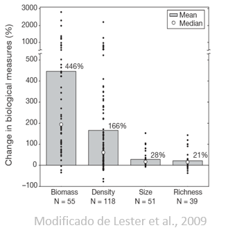

```{r setup, include=FALSE}
knitr::opts_chunk$set(echo = FALSE)

# options(knitr.table.format = "html")

suppressPackageStartupMessages({
  library(tidyverse)
})
```

## Temas

- Áreas Marinas Protegidas

- Categorización de AMPs

- Beneficios de RM

## Áreas Marinas Protegidas (AMP)

- Manejo espacial de actividades humanas (*e.g.* pesca, petróleo, turismo...)
- Herramientas para incrementar resiliencia, conservar biodiversidad, sistemas ecosistémicos
- Evidencia de incrementos en algunos indicadores

<center></center>

## ¿Por qué no funcionan?

*¡Muchos de estos resultados vienen de Reservas Marinas!*

## Categorización de AMPs

- Gran diversidad de objetivos = gran diversidad de nombres:
    - Reserva de la Biosfera
    - Zona de Protección de Flora y Fauna
    - Parque Nacional
    - Santuario
    - Y sus sub-zonas...
- Existen dos maneras generales de categorizar una AMP
    - Según sus metas y objetivos [@iucn_website_2017-Bg]
    - Según sus regulaciones [@hortaecosta_2016-_3]

# Categorización de la IUCN

## Características

- Enfocada en objetivos de manejo
- Reconocidas por la ONU y muchos paises
- Incorporadas en legislación
- [Existen 7 categorías](https://www.iucn.org/es/node/26266)

## Categorias

- Ia Reserva Natural Estricta
- Ib Área de Vida Salvaje
- II Parque Nacional
- III Monumento Característica Natural
- IV Área de Manejo de Hábitat / Especie
- V Paisaje Protegido
- VI Área protegida con uso adecuado de recursos naturales

## Categorias

```{r}
read.csv("Tabs/B1/IUCNChars.csv") %>% 
  knitr::kable()
```

## Desventajas con IUCN

- Fronteras / diferencias entre tipos no están muy claras
    - *e.g.* V vs VI
- Enfocadas en objetivos de manejo
    - Comúnmente objetivos de manejo no se alínean con las regulaciones
- Clasifican el AMP entera, ignorando zonificación
- Al evaluar efectividad, estamos evaluando objetivos, no intervenciones (no es lógico).

# Categorización de @hortaecosta_2016-_3

## Categorización de @hortaecosta_2016-_3

- Enfoque en regulaciones
- 

# Ejemplos

## Parque Nacional Cabo Pulmo

## Reserva de la Biósfera del Caribe

## 

## Referencias

The current IUCN categorisation of MPAs is based on management objectives which many times have a signi fi cant mismatch to regulations causing a strong uncertainty when evaluating global MPAs effectiveness. A

