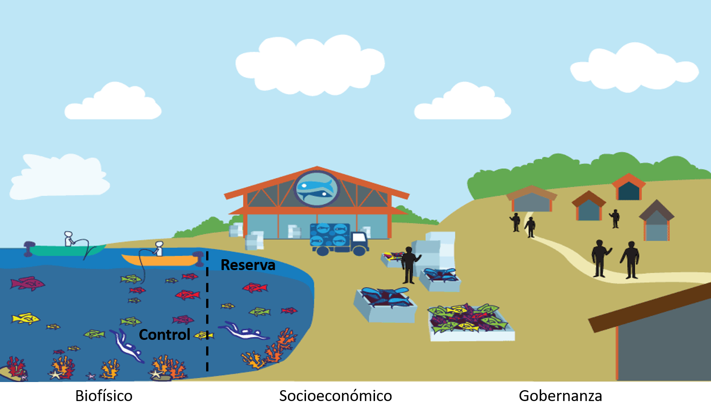

<script src="https://ajax.googleapis.com/ajax/libs/jquery/1.12.2/jquery.min.js"></script>

<script>
    $(document).ready(function() {
    $('slide:not(.title-slide, .backdrop, .segue)').append('<footer></footer>');    
    $('footer').attr('label', 'Bloque 2: Objetivos e indicadores');

  })
</script>

<style>
  footer:after {
    font-size: 12pt;
    content: attr(label);
    position: absolute;
    bottom: 20px;
    left: 60px;
    line-height: 1.9;
    display: block;
  }
</style>

```{r setup, include=FALSE}
knitr::opts_chunk$set(echo = FALSE)
```

## Temas

-
-
-
-


# Marcos para evaluar reservas

## Trabajos anteriores

<center>
 
</center>

## IUCN

- Lista de X indicadores biofísicos y sociales
- Breves indicaciones de como recopilar
- No indica cómo evaluarlos

## @mascia_2017-m_

- Incorpora dimensiones B, S, G

## Estos marcos

- Buena fuente para obtener indicadores
- Indicios sobre evaluación
- No hay herramienta
    - Replicabilidad
    - Estandarización
    - Empoderamiento

# Objetivos

Los indicadores deben de seleccionarse según los objetivos

## Objetivos identificados

Extraidos de DOF, ETJ, planes de manejo

1. 
2. 
3. 
4. 
5. 
6. 
7. 

## Una comunidad costera

```{r, fig.height = 4.5, fig.align = "center"}

```

# Indicadores

## Biológicos

- Biomasa\*
- Densidad\*
- Riqueza
- Índice de Diversidad de Shannon
- Nivel trófico
- Organismos maduros\*
- Perturbación natural

## Socioeconómicos

- Arribos
- Ingresos
- Oportunidades económicas alternativas a la pesca

## Gobernanza

-
-
-
-
-
-
-
-
-
-
-
-
-
-
-


## Referencias


