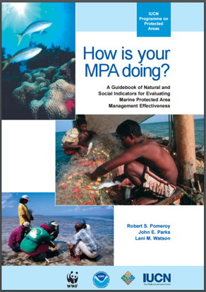
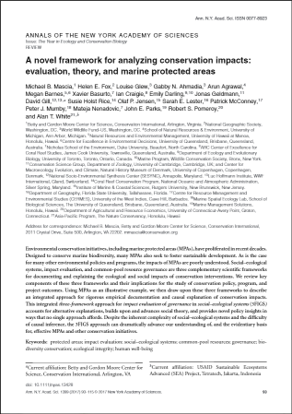

<script src="https://ajax.googleapis.com/ajax/libs/jquery/1.12.2/jquery.min.js"></script>

<script>
    $(document).ready(function() {
    $('slide:not(.title-slide, .backdrop, .segue)').append('<footer></footer>');    
    $('footer').attr('label', 'Bloque 2: Objetivos e indicadores');

  })
</script>

<style>
  footer:after {
    font-size: 12pt;
    content: attr(label);
    position: absolute;
    bottom: 20px;
    left: 60px;
    line-height: 1.9;
    display: block;
  }
</style>

```{r setup, include=FALSE}
knitr::opts_chunk$set(echo = FALSE)
```

## Temas

-
-
-
-


# Marcos para evaluar reservas

## Trabajos anteriores

<center>
 
</center>

## IUCN

- Lista de X indicadores biofísicos y sociales
- Breves indicaciones de como recopilar
- No indica cómo evaluarlos

## @mascia_2017-m_

- Incorpora dimensiones B, S, G

## Estos marcos

- Buena fuente para obtener indicadores
- Indicios sobre evaluación
- No hay herramienta
    - Replicabilidad
    - Estandarización
    - Empoderamiento

# Objetivos

Los indicadores deben de seleccionarse según los objetivos

## Objetivos identificados

Extraidos de DOF, ETJ, planes de manejo

1. 
2. 
3. 
4. 
5. 
6. 
7. 

## Una comunidad costera

```{r, fig.height = 4.5, fig.align = "center"}
knitr::include_graphics("./Figs/B2/comunidad.png")
```

# Indicadores

## Biológicos

- **B1**	Shannon diversity index
- **B2**	Species richness
- **B3**	Density of mature organisms\*
- **B4**	Density\*
- **B5**	Natural Disturbance
- **B6**	Mean Trophic Level
- **B7**	Biomass\*

## Socioeconómicos

- **S1**	Total landings\*
- **S2**	Income from total landings\*
- **S3**	Alternative economic opportunities

## Gobernanza

- **G1**	Access to the fishery
- **G2**	Number of fishers
- **G3**	Legal recognition of reserve
- **G4**	Reserve type
- **G5**	Illegal harvesting
- **G6**	Management plan
- **G7**	Reserve enforcement
- **G8**	Size of reserve
- **G9**	Reasoning for reserve location
- **G10**	Membership to fisher organizations
- **G11**	Type of fisheries organizations
- **G12**	Representation
- **G13**	Internal Regulation
- **G14**	Perceived Effectiveness
- **G15**	Social Impact of Reserve

## Objetivos e Indicadores

```{r}
suppressPackageStartupMessages(library(tidyverse))

read.csv("./Tabs/B2/Objectives_Indicators.csv") %>% 
  select(Objective, B1, B2, B3, B4, B4., B5, B6, B7, B7., S1, S1., S2, S2., S3) %>% 
  knitr::kable(format = "html", col.names = c("Objetivo", "B1", "B2", "B3", "B4", "B4*", "B5", "B6", "B7", "B7*", "S1", "S1*", "S2", "S2*", "S3")) %>% 
  kableExtra::kable_styling(full_width = F)
```

- Todos los de gobernanza se usan siempre


## Referencias


